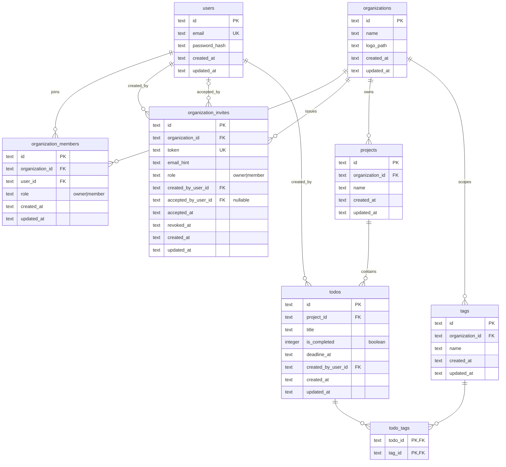

# Database Schema

Derived from the Drizzle schema definitions in
`src/infrastructure/db/schema/`. The database is SQLite; all IDs are
opaque `text` values and most timestamps default to `CURRENT_TIMESTAMP`.

## Tables

- **users** — auth identities (email + password hash).
- **organizations** — top-level tenants.
- **organization_members** — join table linking users to orgs with a
  role (`owner` | `member`).
- **organization_invites** — invite tokens to join an org, with
  creator and optional acceptor.
- **projects** — owned by an organization.
- **todos** — belong to a project, created by a user, optional
  deadline.
- **tags** — scoped to an organization (unique by name within org).
- **todo_tags** — many-to-many between todos and tags (composite PK).

## Entity-relationship diagram

## Key constraints and indexes

- **Cascades**: deleting an organization cascades to members, invites,
  projects, and tags. Deleting a user cascades to memberships, todos
  they created, and invites they created. Deleting a project cascades
  to its todos. Deleting a todo or tag cascades to `todo_tags`.
- **Soft link**: `organization_invites.accepted_by_user_id` is
  `ON DELETE SET NULL`, preserving invite history if the accepting
  user is deleted.
- **Unique constraints**: `users.email`;
  `(organization_members.user_id, organization_id)`;
  `organization_invites.token`;
  `(tags.organization_id, tags.name)`.
- **Indexes**: `organization_members(organization_id)`,
  `organization_invites(organization_id)`,
  `projects(organization_id)`,
  `todos(project_id)`,
  `todos(project_id, deadline_at)`,
  `todo_tags(tag_id)`.
